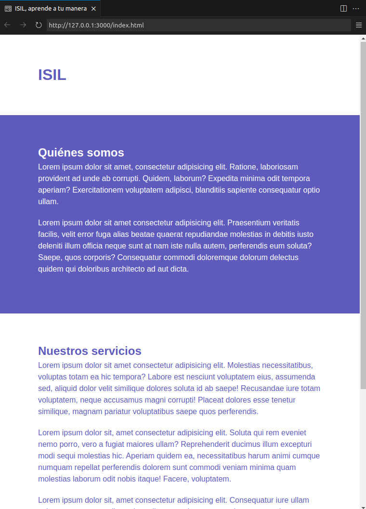
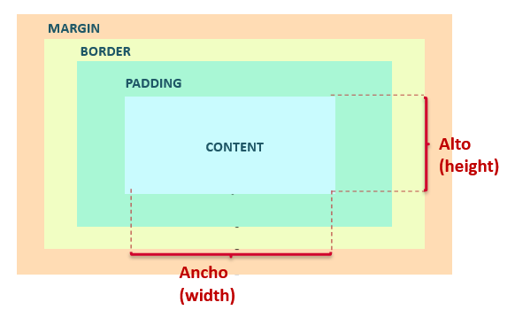
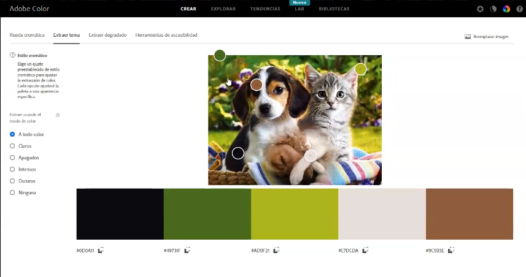

# ÍNDICE
* [Sesion 1](#sesion1)
* [Sesion 2](#sesion2)

# <a name="sesion1"></a>SESION 1
En esta primera sesion, se explico la estructura basica html.


# <a name="sesion2"></a>SESION 2

En esta sesion necesitamos tener 2 archivos:

```bash
1658-202320/
├── estios.css
└── index.html
```
Dento del index.html en head insertamos lo siguiente para enlazarlo con la hoja de estilos:
```html
<head>
    ...
    <link rel="stylesheet" href="estilos.css">
</head>
```


## SELECTORES DE ESTILOS 
Existen 3 categorias y una universal que son las siguientes:
1. Selector de estilos tipo html
    - Etiquetas
    > Escribimos lo siguiente en **estilos.css**
    
    ```css
        body {
            color: blue;
        }
    ```

2. Selector de estilos tipo ID
    * Solo se debe de usar una vez, porque tambien sirve para identificarlos (como si fuera su DNI)
    * Inician con #nombre

    > Escribimos lo siguiente en **estilos.css**
    ```css
        #nosotros {
            color: blue;
        }
    ```

3. Selector de estilo de tipo class
    * Inician con .nombre
    * Se puede reutilizar mas de una vez

    > Escribimos lo siguiente en **estilos.css**
    ```css
        .subtitulo {
            color: brown;
        }
    ```

4. Selector universal de elementos
    * Para anular por ejemplo los margenes y espaciados predeterminados del navegador
    > Escribimos lo siguiente en **estilos.css**
    ```css
        * {
            margin: 0;
            padding: 0;
        }
    ```

## RESULTADO


### ACTIVIDAD PARA LA SESION 3
Cambiarle el tipo de letra a la pagina a Poppins, siguiente este 
[tutorial](https://www.youtube.com/watch?v=O3gZbtB2tQo)

# <a name="sesion3"></a>SESION 3


## Variables de estilos
Declarar variables en CSS, nos permite no repetir el codigo.
Por ejemplo, declarar los colores que usaremos:

```css
:root {
    --base: #fff;
    --primary-color: #5E5BBC;
    --secondary-color: #344856;
    --tertiary-color: #203646;
}
```

Finalmente, para usarlo lo haremos de la siguiente manera:
```css
h1 #principal {
    color: var(--primary-color);
}
```

## Cajas

wight -> es del content
padding -> espacio interno
border -> borde de la caja
margin -> espacio exterior
Todas estas medidas se suma.

Pero si no queremos que se modifique el ancho declarado en el content debemos de agregar la siguiente propiedad:
```css
box-sizing: border-box;
```


## Flexbox


## Insertar imagenes
Se recomienda declararlas dentro de un div. Para establecer el tamaño
de la caja y la imagen se ajuste a el.

# <a name="sesion4"></a>SESION 4

## Colores

Es mejor usar codigos de color de plantillas o usar herramientas como adobe color
* coolors.co
* adobe color 

Hay diferentes formas de declararlos:

```css
--color1: #ffffff;
--color2: black;
--color3: rgb(80,55,30)
--color4: hsl(0, 0%, 0%)
```

## Copyright
Para descargar imagees 
-> pexels.com
-> unsplash.com

## Generar CSS
cssgenerator.org

## Hosting gratuito
https://www.000webhost.com/


# <a name="sesion5"></a>SESION 5
